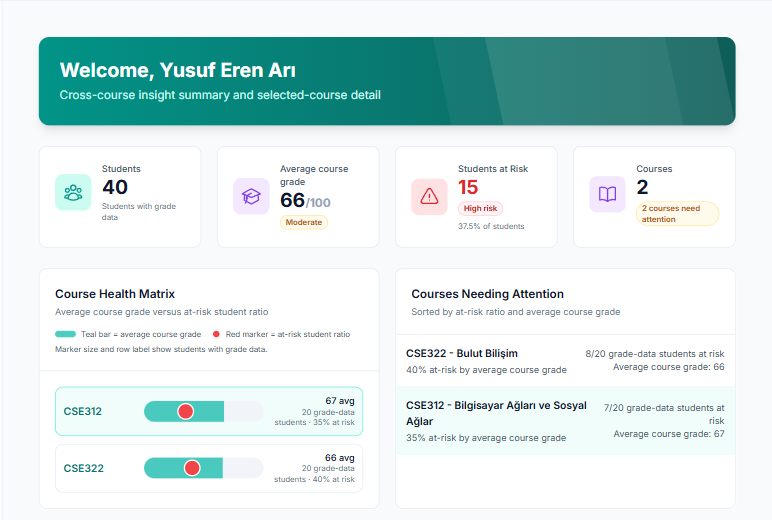
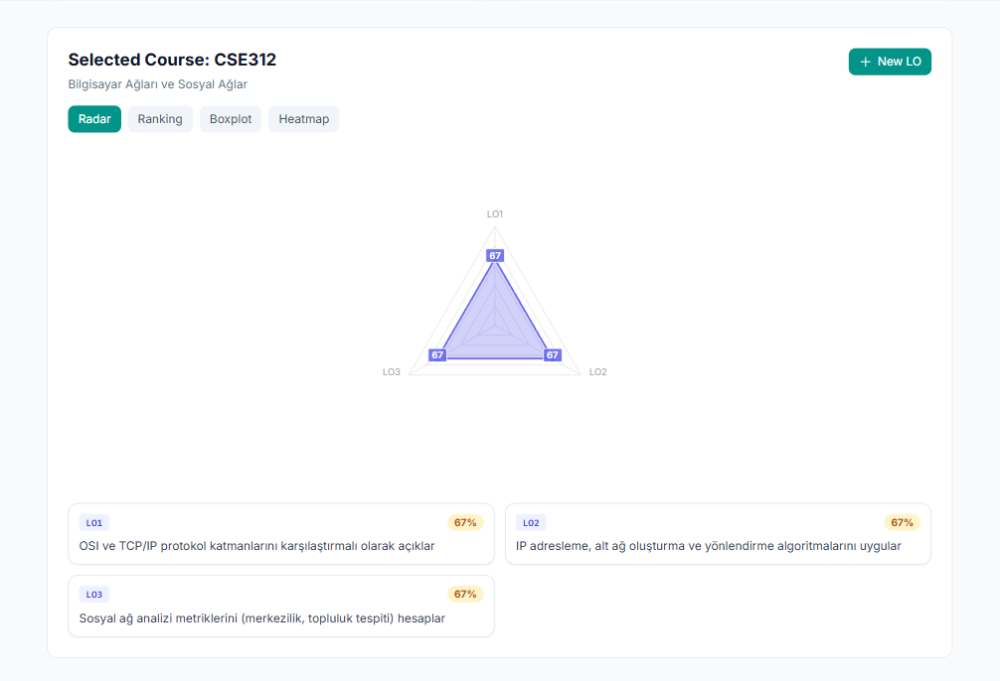
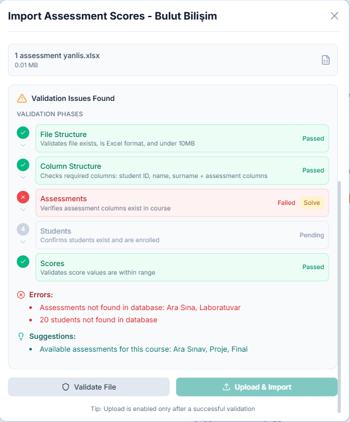
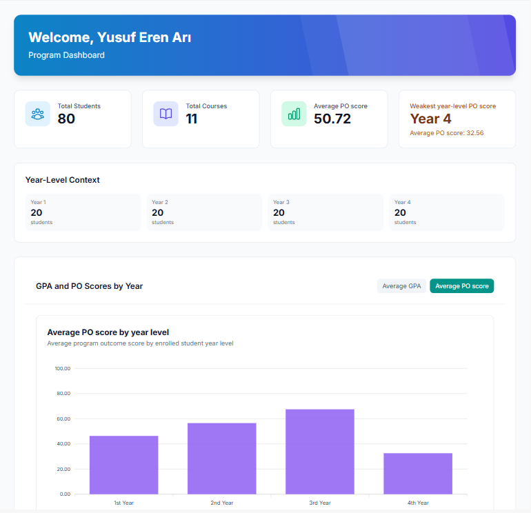
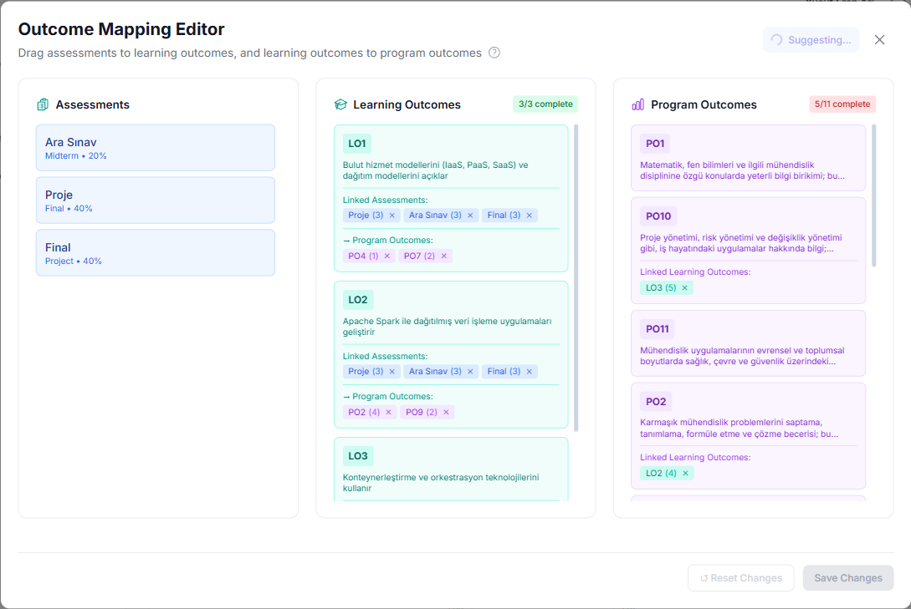

# Student Evaluation System (SES)

Student Evaluation System (SES) is an outcome-based assessment platform for higher education. It helps instructors and department or program heads map assessments to learning outcomes (LOs) and program outcomes (POs), import and validate grades, recompute scores, and review course- and program-level analytics.

## Demo Screenshots

### Instructor Dashboard



*Summarizes course health, average grades, at-risk student ratios, and courses needing attention.*

### Course Outcome Analytics



*Shows selected-course learning outcome achievement using visual analytics and outcome-level cards.*

### Grade Import Validation



*Validates uploaded assessment score files through multiple phases and guides the user through missing assessments, students, or invalid scores.*

### Program Dashboard



*Provides department/program-level insight into students, courses, GPA, and program outcome performance by year level.*

### Outcome Mapping Editor



*Allows assessments to be linked to learning outcomes, and learning outcomes to be linked to program outcomes with configurable mappings.*

## Key Features

- Course, assessment, learning outcome, and program outcome management
- Assessment-to-LO and LO-to-PO mapping
- Spreadsheet-based grade import
- Multi-phase validation and resolution flow
- Asynchronous score recomputation with Celery and Redis
- Instructor, student, and department/head dashboards
- Generated frontend API client from the backend OpenAPI schema
- Docker-based local development setup

## System Architecture

SES is split into independently running frontend, API, data, and background-processing services:

- **Frontend — React + Vite:** dashboards, forms, import and resolution flows, and notifications
- **Backend — Django + Django REST Framework:** REST API, validation, import orchestration, and business logic
- **Database — PostgreSQL:** relational application data
- **Background jobs — Celery + Redis:** asynchronous recomputation, with Redis as broker and result backend
- **API schema and docs — drf-spectacular + Swagger:** OpenAPI schema generation and browsable API documentation

Grade imports follow this flow:

1. The user uploads a file in the frontend.
2. The backend validates its structure, students, assessments, and score consistency.
3. Valid data is persisted.
4. The backend enqueues score recomputation jobs through Celery.
5. The frontend polls job status and displays session notifications.
6. The interface refreshes when recomputation completes.

The main backend modules are `core/` for courses, imports, and validation; `evaluation/` for enrollments, grades, recomputation, and outcome calculations; and `users/` for authentication and profiles. Frontend features are grouped by authentication, courses, and dashboards, with reusable API, layout, and context code under `shared/`.

## Tech Stack

| Area | Technologies |
| --- | --- |
| Frontend | React, Vite, TypeScript |
| Backend | Django, Django REST Framework, Celery |
| Database / Queue | PostgreSQL, Redis |
| Tooling | Docker Compose, uv, Ruff, Pytest, Vitest, ESLint |
| API | OpenAPI schema, generated frontend client |

## Quick Start

Docker Compose is the recommended local development setup.

### Prerequisites

- Docker Desktop, or Docker Engine with the Compose plugin
- Git

### 1. Clone the repository

```bash
git clone <your-repo-url> ses
cd ses
```

### 2. Configure environment files

```bash
cp backend/.env.example backend/.env
cp frontend/.env.example frontend/.env.development
```

The Compose defaults expose the backend at `http://localhost:8000`, the frontend at `http://localhost:5173`, PostgreSQL at `localhost:5432`, and Redis at `localhost:6379`.

### 3. Start the services

```bash
docker compose up --build
```

This starts PostgreSQL, Redis, the Django backend, Celery workers, and the Vite frontend.

### 4. Run database migrations

In a separate terminal:

```bash
docker compose exec backend uv run --no-sync python student_evaluation_system/manage.py migrate
```

### 5. Open the application

- Frontend: <http://localhost:5173>
- Backend API: <http://localhost:8000>
- OpenAPI schema: <http://localhost:8000/api/schema/>
- Swagger UI: <http://localhost:8000/api/docs/>

### Useful Docker commands

```bash
# Follow service logs
docker compose logs -f backend
docker compose logs -f celery_worker
docker compose logs -f frontend

# Stop services
docker compose down

# Stop services and remove local data volumes
docker compose down -v
```

### Optional local workflow

Backend:

```bash
cd backend
uv sync
uv run python student_evaluation_system/manage.py migrate
uv run python student_evaluation_system/manage.py runserver
```

Frontend:

```bash
cd frontend
npm install
npm run dev
```

## Development Commands

### Backend

Run from `backend/student_evaluation_system`:

```bash
uv run python manage.py check
uv run python manage.py makemigrations
uv run python manage.py migrate
uv run python manage.py seed_data
uv run pytest
uv run pytest --cov=student_evaluation_system
uv run ruff check .
uv run ruff format --check .
```

### Frontend

Run from `frontend`:

```bash
npm run lint
npm run test -- --run
npm run test:coverage
npm run build
```

Regenerate the frontend API client after backend schema changes:

```bash
cd frontend
npm run generate:api
```

## Project Structure

```text
backend/             Django API, domain logic, tests, and Celery tasks
frontend/            React application and generated API client
docs/                Architecture notes, project data, and screenshots
docker-compose.yml   Local service orchestration
.github/workflows/   CI, security, and container build workflows
```

## Current Status / Future Objectives

SES currently supports its core academic workflow through the web application, REST API, background workers, and Docker-based local environment. The following are future objectives rather than claims about the current production readiness:

- Harden deployment configuration, security, scaling, and backup procedures
- Add job metrics, tracing, and operational dashboards
- Improve auditability for imports, resolutions, and recalculation actions
- Expand LO/PO trend and cohort analytics
- Replace polling with push-based real-time updates through WebSocket or SSE where appropriate

## Notes

- CI and backend dependency management use `uv`.
- Frontend API clients are generated from the backend OpenAPI schema and should not be edited manually.
- SES is an academic senior design full-stack system.
- Project-specific agent guidance is available in `.github/copilot-instructions.md`.
